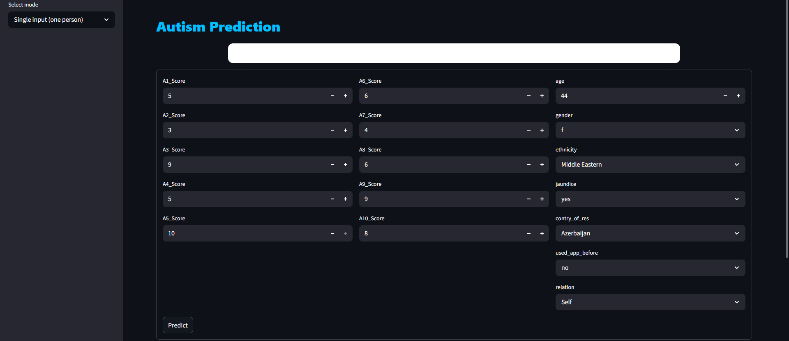

# Autism Spectrum Disorder (ASD) Prediction

A machine learning web app that predicts the likelihood of Autism Spectrum Disorder traits based on the AQ-10 screening questionnaire and basic demographic information.

## Overview

Autism screening tools like the AQ-10 (Autism Spectrum Quotient) are widely used as a quick first-pass indicator of autistic traits in adults. This project takes AQ-10 responses along with demographic data (age, gender, ethnicity, jaundice history, family autism history, etc.) and trains a classification model to estimate the probability that a person shows ASD traits.

The project covers the full pipeline: exploratory data analysis, preprocessing, model selection with hyperparameter tuning, and a deployed Streamlit app for real-time predictions.

## Demo

The app supports two modes:
- **Single input** — fill out the AQ-10 form for one person and get an instant probability
- **Batch prediction** — upload a CSV/Excel file of multiple records and download predictions for all of them




## How It Works

1. **EDA & Cleaning** — Analyzed the AQ-10 dataset (800 records), identified class imbalance (639 negative / 161 positive), standardized inconsistent country names, consolidated rare categories in `ethnicity` and `relation`, and handled outliers in `age` and `result` using the IQR method.
2. **Preprocessing** — Label-encoded all categorical features and saved the encoders for consistent inference-time transformation.
3. **Handling Class Imbalance** — Applied **SMOTE** (Synthetic Minority Oversampling) on the training set to balance the two classes before model training.
4. **Model Selection** — Trained and cross-validated three candidate models: Decision Tree, Random Forest, and XGBoost. Each was tuned using `RandomizedSearchCV` over a dedicated hyperparameter grid, and the best-performing model was selected automatically based on cross-validated accuracy.
5. **Result** — **XGBoost** was selected as the best model, achieving **93% accuracy** on the held-out test set.
6. **Deployment** — Built a Streamlit interface that loads the trained model and encoders, and returns a probability score (e.g. "62% chance of autism traits") rather than a plain yes/no label.

## Tech Stack

- **Language:** Python
- **Data Handling:** Pandas, NumPy
- **Modeling:** Scikit-learn, XGBoost
- **Imbalance Handling:** imbalanced-learn (SMOTE)
- **Visualization:** Matplotlib, Seaborn
- **App/Deployment:** Streamlit

## Project Structure

```
autism-prediction/
├── main.ipynb          # EDA, cleaning, preprocessing, encoding
├── main.py             # Model training, tuning, and selection
├── app.py              # Streamlit web app (single + batch prediction)
├── checking.py         # Manual sanity-check script for the saved model
├── best_model.pkl       # Trained XGBoost model (best performer)
├── encoders.pkl         # Saved label encoders for categorical features
├── final_data.csv       # Cleaned dataset used for training
└── requirements.txt     # Python dependencies
```

## Installation & Usage

```bash
# Clone the repository
git clone https://github.com/AyaanHussain1/autism-prediction.git
cd autism-prediction

# Install dependencies
pip install -r requirements.txt

# Run the app
streamlit run app.py
```

## Results

| Model         | Cross-Validated Accuracy |
|---------------|---------------------------|
| Decision Tree | Evaluated, not selected   |
| Random Forest | Evaluated, not selected   |
| **XGBoost**   | **93% (best)**             |

## Disclaimer

This tool is built for educational and portfolio purposes only. It is **not a diagnostic tool** and should not be used as a substitute for professional medical or psychological evaluation.
